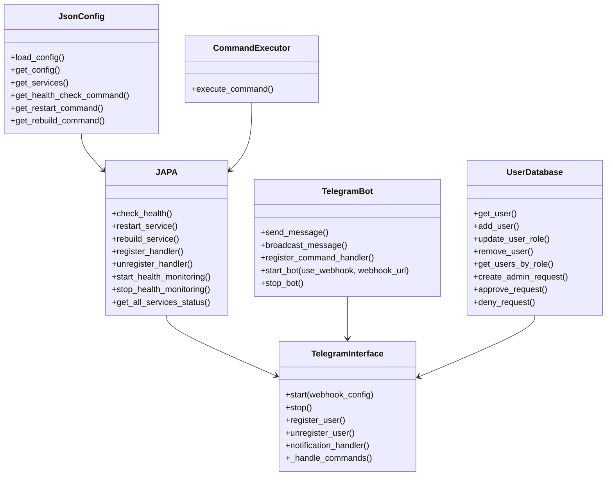
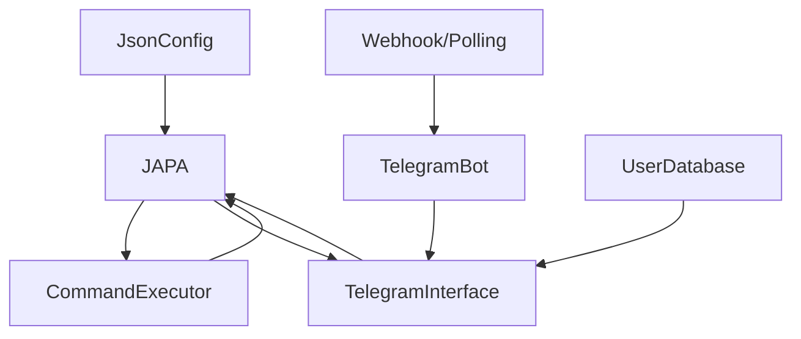

# Just Another Process Assistant (JAPA)
JAPA project is a Python Telegram bot that monitors the health of services on a server and allows for remote management through Telegram.

## Architecture

### Classes

- `JsonConfig` class:
    - Loads configuration from a JSON file
    - Provides methods to access specific service configurations
    - Retrieves health check, restart, and rebuild commands

- `TelegramBot` class:
    - Handles communication with the Telegram Bot API
    - Supports both polling mode and webhook mode for receiving updates
    - Manages command handlers and message sending
    - Provides robust error handling and reconnection logic

- `CommandExecutor` class:
    - Executes shell commands safely
    - Captures stdout and stderr
    - Implements timeout handling for long-running commands (5 minute timeout)
    - Returns standardized result tuple (success, message)

- `JAPA` class:
    - Core service monitoring engine
    - Integrates JsonConfig and CommandExecutor
    - Provides health checking, service restart, and rebuild capabilities
    - Implements the observer pattern for notifications
    - Runs background monitoring thread for periodic health checks

- `TelegramInterface` class:
    - Connects JAPA with Telegram
    - Manages user registration for notifications
    - Processes command requests from users
    - Dispatches notifications to registered users
    - Provides a complete command handler interface
    
- `UserDatabase` class:
    - Manages SQLite database for user information
    - Handles user roles (regular, admin, superadmin)
    - Manages pending admin requests
    - Provides methods for user management (add, update, remove)
    - Supports migration from JSON to SQLite

### Class Diagram



### System Flow



## Configuration

JAPA uses a two-file configuration system:

### 1. JAPA Configuration (config.json)

The main service configuration file defines services and their management commands:

```json
{
    "immich": {
        "health_check": "health_check_podman.sh immich_redis immich_machine_learning immich_postgres immich_server",
        "restart": "cd /mnt/nas/immich && podman compose up -d",
        "rebuild": "cd /mnt/nas/immich && podman compose pull && podman compose up -d --force-recreate"
    },
    "jellyfin": {
        "health_check": "health_check_podman.sh jellyfin",
        "restart": "podman restart jellyfin",
        "rebuild": "podman compose pull docker.io/jellyfin/jellyfin:latest && podman run -it -d --name jellyfin --net=host --volume /mnt/nas/docker_folders/jellyfin/config:/config --volume /mnt/nas/docker_folders/jellyfin/cache:/cache --mount type=bind,source=/mnt/nas,target=/media --restart=unless-stopped --device /dev/dri/renderD128:/dev/dri/renderD128 --device /dev/dri/renderD129:/dev/dri/renderD129 --replace jellyfin/jellyfin"
    }
}
```

Configuration for each service can include:
- `health_check`: Command to check service health
- `restart`: Command to restart the service
- `rebuild`: Command to rebuild/recreate the service

### 2. Telegram Interface Configuration (telegram_config.json)

This file contains Telegram-specific configurations:

```json
{
    "token": "YOUR_TELEGRAM_BOT_TOKEN",
    "db_path": "users.db",
    "superadmin_ids": [123456789],
    "webhook": {
        "use_webhook": false,
        "webhook_url": "",
        "webhook_port": 8443,
        "cert_path": ""
    }
}
```

This configuration includes:
- `token`: Telegram Bot API token 
- `db_path`: Path to the SQLite database file
- `superadmin_ids`: List of Telegram user IDs that will have superadmin privileges
- `webhook`: Configuration for webhook mode (optional)

## Telegram Webhook vs Polling

### What is a Webhook?

A webhook is a mechanism where Telegram sends real-time updates to your bot by making HTTP requests to a URL you specify whenever there's a new message or event. It's a "push" approach rather than the "pull" approach of polling.

### Polling Mode

In polling mode, your bot repeatedly asks Telegram "Do you have any new messages for me?" This is simple but inefficient:

- Pros:
  - Easier to set up - no public server needed
  - Works behind firewalls and NATs
  - Simple to implement
- Cons:
  - Higher latency - messages processed in batches
  - Consumes more bandwidth and resources
  - Less efficient for bots with sporadic usage

### Webhook Mode

In webhook mode, Telegram directly notifies your bot when new messages arrive:

- Pros:
  - Real-time updates - lower latency
  - More efficient use of resources
  - Better for production environments
- Cons:
  - Requires a publicly accessible HTTPS server
  - Needs SSL certificate
  - More complex setup

### Using Webhooks with JAPA

To use webhook mode, you need:

1. A public-facing server with a valid SSL certificate
2. Open port (default: 8443)
3. Run JAPA with webhook parameters:

```bash
python src/main.py --config config.json --webhook --webhook-url https://your-server.com:8443
```

You can also specify a custom port and certificate path:

```bash
python src/main.py --config config.json --webhook --webhook-url https://your-server.com:8443 --webhook-port 8443 --cert-path /path/to/cert.pem
```

The JAPA bot will automatically handle setting up the webhook with Telegram and will fall back to polling mode if webhook setup fails.

## Features

### JsonConfig
- Parses and validates JSON configuration
- Provides typed access to configuration values
- Supports nested configuration for different services
- Handles missing configurations gracefully

### CommandExecutor
- Executes shell commands with proper error handling
- Captures stdout and stderr
- Implements timeout for command execution (5 minutes)
- Returns standardized result tuple (success, message)

### JAPA
- Health monitoring:
  - Checks service health via configured commands
  - Supports checking specific services or all services
  - Maintains status history
- Service management:
  - Restart services with proper error handling
  - Rebuild services with proper error handling
- Notification system:
  - Observer pattern for health status notifications
  - Register/unregister notification handlers
- Background monitoring:
  - Thread-based periodic health checking
  - Configurable check interval

### TelegramBot
- Messaging:
  - Send messages to individual users
  - Broadcast messages to multiple users
- Command handling:
  - Register command handlers
  - Process incoming commands
  - Handle unknown commands gracefully
- Connectivity:
  - Polling mode for simple deployments
  - Webhook mode for improved efficiency
  - Auto-fallback to polling if webhook setup fails
  - Proper error handling and reconnection logic

### TelegramInterface
- User management:
  - Registration/unregistration of users
  - Persistence of user data
  - Role-based access control (regular, admin, superadmin)
  - Admin promotion workflow
- Command processing:
  - `/start` - Register for notifications
  - `/stop` - Unregister from notifications
  - `/status [service]` - Check service status
  - `/list` - List all configured services
  - `/help` - Show available commands
  - Admin Commands:
    - `/restart <service>` - Restart a service
    - `/rebuild <service>` - Rebuild a service
  - Superadmin Commands:
    - `/admins` - List all admins
    - `/promote <user_id>` - Promote a user to admin
    - `/demote <user_id>` - Demote an admin to regular user
    - `/remove <user_id>` - Remove a user completely from the database
  - Regular User Commands:
    - `/requestadmin [reason]` - Request admin privileges
- Notification delivery:
  - Send health status notifications to registered users
  - Format messages for readability

## Running the Bot

JAPA supports two modes of operation and various configuration options:

### Polling Mode (Simple)
```bash
python src/main.py --config config.json --telegram-config telegram_config.json
```

### Webhook Mode (Efficient)
```bash
python src/main.py --config config.json --telegram-config telegram_config.json --webhook --webhook-url https://your-server.com:8443
```

### Command Line Options
```
usage: main.py [-h] [-c CONFIG] [--telegram-config TELEGRAM_CONFIG] [--token TOKEN] 
               [--debug] [--webhook] [--webhook-url WEBHOOK_URL] [--webhook-port WEBHOOK_PORT] 
               [--cert-path CERT_PATH] [--db-path DB_PATH] [--superadmin-id SUPERADMIN_ID]
               [--migrate-users MIGRATE_USERS]
```

Key options:
- `-c/--config`: Path to JAPA configuration file
- `--telegram-config`: Path to Telegram interface configuration
- `--token`: Telegram bot token (overrides config)
- `--debug`: Enable debug logging
- `--webhook-*`: Webhook configuration options
- `--db-path`: Path to SQLite database file
- `--superadmin-id`: Add a superadmin user ID
- `--migrate-users`: Migrate users from JSON to SQLite

### Environment Variables
- `TELEGRAM_TOKEN`: Telegram bot token
- `JAPA_DB_PATH`: Database path
- `JAPA_SUPERADMIN_ID`: Comma-separated list of superadmin IDs

## Architecture Review

The JAPA system is designed with a clear separation of concerns, following modular design principles:

1. **Core Components**:
   - **JAPA**: Central engine that manages service health checks and operations
   - **JsonConfig**: Configuration management
   - **CommandExecutor**: Command execution layer
   - **TelegramBot**: Communication layer
   - **TelegramInterface**: User interface layer

2. **Key Design Patterns**:
   - **Observer Pattern**: JAPA uses handler registration for push notifications
   - **Facade Pattern**: JAPA acts as a simplified interface to complex subsystems
   - **Command Pattern**: CommandExecutor separates command execution from invocation
   - **Strategy Pattern**: Support for different update receiving strategies (polling/webhook)

3. **Strengths**:
   - Good separation of concerns
   - Extensible design (easy to add more services or notification methods)
   - Configurable via JSON (no code changes needed for new services)
   - Asynchronous health monitoring
   - Support for both polling and webhook modes
   - Comprehensive error handling and logging

4. **Areas for Future Enhancement**:
   - Metrics collection and visualization
   - More flexible notification filtering
   - Further security enhancements (2FA, rate limiting)
   - Service-specific custom commands
   - Support for service dependencies
   - User ID encryption/hashing

Overall, the architecture provides a solid foundation for a service monitoring system. Its modular design allows for future extensions and maintenance while keeping components loosely coupled.
    
